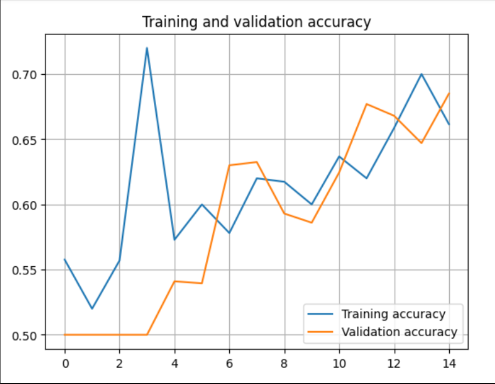
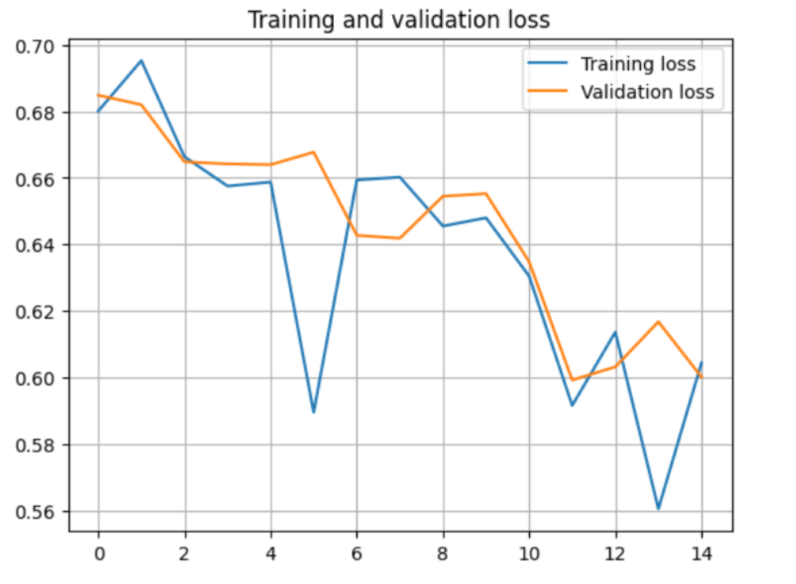

# 🐱🐶 Cats vs Dogs — CNN with Keras/TensorFlow

A clean, reproducible image classification project that distinguishes **cats** and **dogs** using a compact **Convolutional Neural Network (CNN)**.  
Designed to run smoothly on **Google Colab** (CPU or GPU) and to be easy to ship to **GitHub**.

> **Author:** **Menashe Yaskil**

---

## ✨ Highlights
- Minimal, readable notebook blocks (Imports → Data → Model → Train → Evaluate → Inference)
- Works out‑of‑the‑box on **Colab** with Google Drive datasets
- EarlyStopping + ModelCheckpoint for robust training
- Ready to publish: `requirements.txt`, `.gitignore`, `README.md`, `RESULTS.md`
- Figures stored in `assets/` so GitHub renders them in docs

---

## 📁 Recommended Structure
```
.
├─ cats_vs_dogs.ipynb           # Your Colab/Notebook
├─ requirements.txt
├─ .gitignore
├─ README.md
├─ RESULTS.md
└─ assets/
   ├─ accuracy.png              # Saved after training
   └─ loss.png                  # Saved after training
```

---

## 🚀 Quickstart (Google Colab)
1. Mount Google Drive and ensure your data is organized like:
   - `/content/drive/MyDrive/DataSet/training_set/{cats,dogs}`
   - `/content/drive/MyDrive/DataSet/test_set/{cats,dogs}`
   - `/content/drive/MyDrive/DataSet/real_pictures`
2. Run the notebook cells in order:
   - **Imports & Seed**
   - **Data Generators** (augmentation + rescale)
   - **Model** (compact CNN with Dropout)
   - **Training** (EarlyStopping + Checkpoint to Drive)
   - **Evaluation & Plots**
   - **Inference** on `real_pictures`
3. Save plots so they appear in this README:
   ```python
   import os
   os.makedirs("assets", exist_ok=True)
   plt.figure(); ...  # accuracy figure
   plt.savefig("assets/accuracy.png", dpi=150, bbox_inches="tight")
   plt.figure(); ...  # loss figure
   plt.savefig("assets/loss.png", dpi=150, bbox_inches="tight")
   ```

> Tip: If you don’t see a GPU in Colab, use **Runtime → Change runtime type → GPU**. The project also runs on CPU with smaller image sizes and lighter augmentation.

---

## 🧠 Model Pipeline (Overview)
1. **Data:** `ImageDataGenerator` with `rescale=1/255` and light augmentation for train; rescale‑only for validation
2. **CNN:** 3–4 Conv2D blocks + MaxPooling → Flatten/GlobalPooling → Dense head with `sigmoid` (binary)
3. **Loss/Opt:** `binary_crossentropy` + `Adam`
4. **Callbacks:** EarlyStopping (patience 3–5), ModelCheckpoint (best weights)
5. **Metrics:** Accuracy (optionally AUC). Plots saved to `assets/`

---

## 📊 Results (Snapshots)
See **RESULTS.md** for full metrics and notes.




---

## 🖥️ Local Run (Optional)
```bash
python -m venv venv
source venv/bin/activate        # Windows: venv\Scripts\activate
pip install -r requirements.txt
# Open the notebook with Jupyter/VS Code, or port functions into src/ if you modularize
```

---

## 🔁 Reproducibility
- Random seed set via `tf.keras.utils.set_random_seed(42)`
- Keep dataset splits stable; avoid data leakage between `training_set` and `test_set`
- Record your exact environment and best checkpoint path in **RESULTS.md**

---

## 📄 License
MIT — © 2025 **Menashe Yaskil**
