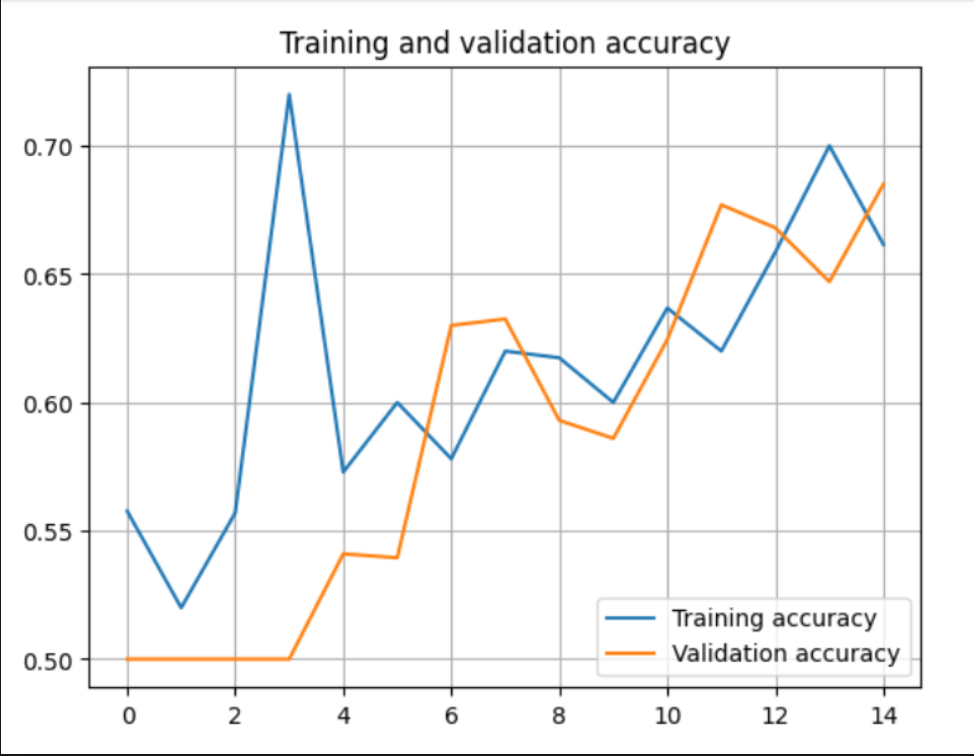

# 📓 Experiment Report — Cats vs Dogs (Archived Baseline)

Author: **Menashe Yaskil**  
Status: Archived baseline — detailed metrics not re-run.

## Figures

## Notes
- Baseline CNN trained in Colab.
- Approx. validation accuracy observed: ~0.66–0.70.
- Hardware/time vary; see README for pipeline. 
